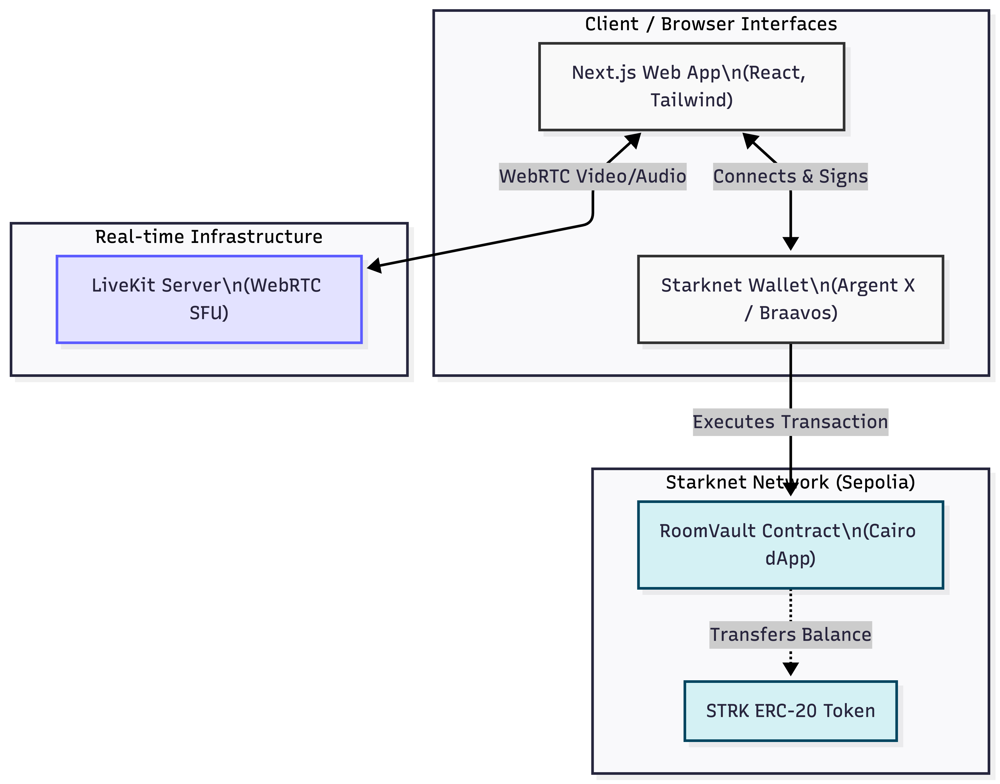

# Room

**Build. Learn. and Collaborate in One Room**

<p align="center">
  
  
  
</p>

---

## The Problem

The Web3 ecosystem is built on the promise of seamless, borderless value transfer, yet the tools we use to build, learn, and collaborate in this space remain stuck in Web2 walled gardens. 

For DAO builders, educators, and hackathon organizers, **coordinating humans and capital** currently requires a fragmented, high-friction workflow. Today, hosts are forced to:

1. **Juggle Disjointed Platforms:** Use Google Meet or Zoom for video, Telegram/Discord for chat, and a separate block explorer or wallet extension just to distribute rewards or verify holdings.
2. **Endure Manual Token Distribution:** Sending bounties, paying for class access, or tipping great questions requires copy-pasting addresses, manually signing transactions, and waiting for slow block times—completely killing the live momentum.
3. **Lack Verifiable Context:** Meeting organizers have no native way to gate access based on token holdings or ensure the person speaking is actually the active contributor on-chain.

---

## The Solution

**Room: WebRTC meets native Starknet execution.** 

Room is not just another video conferencing app; it is a **Starknet-native collaboration environment**. By deeply integrating high-quality, low-latency video (powered by LiveKit) with Cairo smart contracts, Room allows communities to collaborate face-to-face and move capital in the same breath.

**With Room, you can:**
- **Reward in Real-Time:** Send STRK tokens to a participant *during* a hackathon presentation or a workshop, instantly, without ever leaving the video grid.
- **Transact at Scale:** Leverage Starknet's high throughput and low fees to make micro-transactions (tips, bounties, class access) economically viable.
- **Unified Identity:** Your Starknet wallet (Argent/Braavos) is your identity. No usernames, no passwords—just cryptographic proof of who you are and what you hold.

## Technical Architecture

Room leverages a hybrid architecture, combining Web2 real-time video infrastructure with Web3 decentralized identity and settlement.

<p align="center">
  
</p>

### Core Components

1. **Next.js & Starknetkit (Frontend)**
   The main entry point manages the user interface, video grids, profile customization, and wallet connection. It explicitly connects to Starknet wallets using `starknetkit` and `@starknet-react/core` to authenticate via digital signatures.
   
2. **LiveKit Server (WebRTC)**
   Handles the heavy lifting of routing multi-party video and audio streams seamlessly with ultra-low latency. It generates secure tokens for validated attendees to enter designated collaboration rooms.

3. **RoomVault Contract (Cairo)**
   A pure native Starknet smart contract that handles deposits, tracks individual and event balances, and enforces the peer-to-peer distribution flow of STRK tokens among participants—bypassing lengthy cross-chain bridges.

---

## Repository Structure

This repository contains both the frontend application and the on-chain smart contracts.

| Directory | Description |
|-----------|-------------|
| [`/src`](./src) | Next.js Frontend — Landing page, dashboard, meeting rooms |
| [`/contracts`](./contracts) | Cairo Smart Contracts — RoomVault vault and token logic |

---

### 1. Web Application (`/src`)

> The main web frontend — user interface and meeting UI

**Tech Stack:**
- **Frontend:** Next.js 14, React 18, Tailwind CSS, Lucide React
- **Video/Audio:** LiveKit (`@livekit/components-react`, `livekit-server-sdk`)
- **Blockchain:** Starknet React (`@starknet-react/core`), Starknet.js, Starknetkit

**Features:**
- Native Starknet wallet support (Argent X, Braavos)
- Live video meetings with custom avatar overlays
- Personalized profiles (Display Name, Avatar, Email)
- Actionable dashboard with STRK wallet balance and transaction history
- Smooth, modern, UI for Web3 collaboration

**Quick Start:**
```bash
npm install
npm run dev
# App runs on http://localhost:3000
```

---

### 2. Smart Contracts (`/contracts/room_vault`)

> On-Chain Vault System — Built with Cairo and deployed on Starknet

**Tech Stack:**
- **Language:** Cairo
- **Toolchain:** Scarb
- **Network:** Starknet (Sepolia Testnet)

**What It Does:**
Implements a **RoomVault** smart contract that allows platform users to deposit, withdraw, and send STRK tokens natively to other participants of the platform.

| Component | Status |
|-----------|--------|
| Vault Contract (room_vault) | ✅ Working — Compiles successfully |
| Deployment Script | ✅ Available (`deploy_room_vault.sh`) |
| Contract Deployment | ✅ Deployed — Starknet Sepolia |

**Installation:**
```bash
# Prerequisites
# - Scarb
# - Starkli

# Build contracts
cd contracts/room_vault
scarb build
```

---

## Use Cases

### 1. Web3 Hackathons & Bounties

A protocol wants to host a virtual hackathon. They use Room to conduct live workshops and instantly distribute STRK bounties to top participants directly within the meeting interface.

### 2. Paid Educational Classes

An educator teaches Cairo development courses online. Students can connect their wallets, pay for entry using Starknet's low fees, and join high-quality video classrooms.

### 3. DAO Governance Calls

A DAO wants to verify token holdings or identity before allowing members to speak or vote during a community call. They use Room's Starknet integration to ensure only relevant community members can participate fully.

---

## Key Features

| Feature | Description |
|---------|-------------|
| **Starknet Native** | Built with Cairo, interacting seamlessly with Starknet networks |
| **Integrated Video** | Low-latency WebRTC streams powered by LiveKit |
| **Seamless Wallet UX** | Deep integration with Argent X and Braavos via Starknetkit |
| **Instant Rewards** | On-chain STRK token management to immediately reward participants |

---

## Contributing

1. Fork the repository
2. Create a feature branch
3. Submit a pull request

For smart contract contributions, check the `/contracts` directory.

---

## License

MIT License.

---

<p align="center">
  <strong>Build. Learn. and Collaborate in One Room.</strong>
</p>
